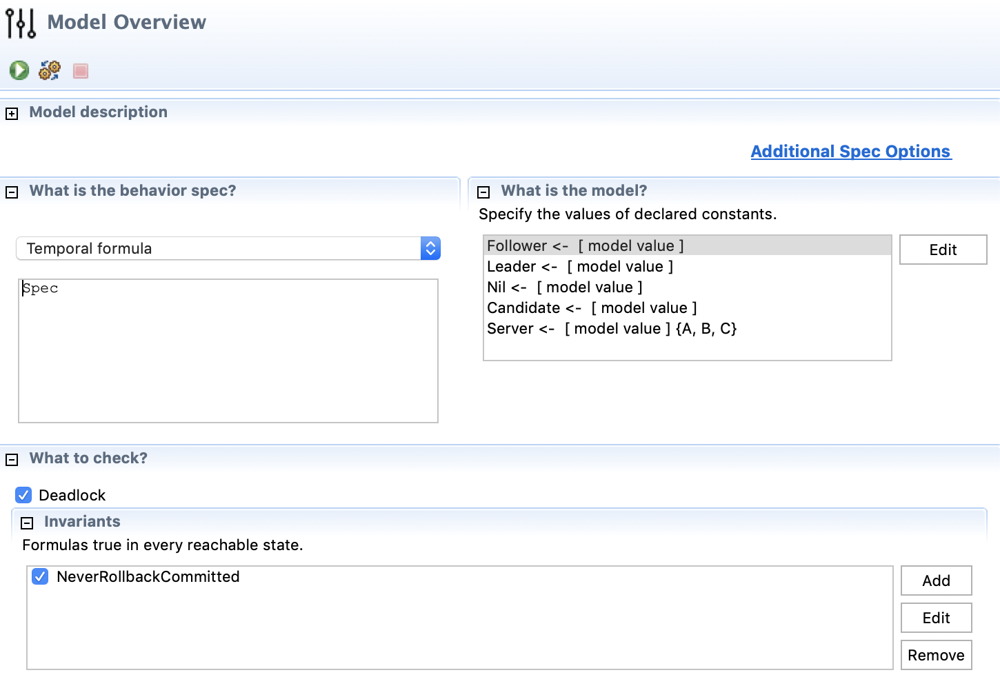
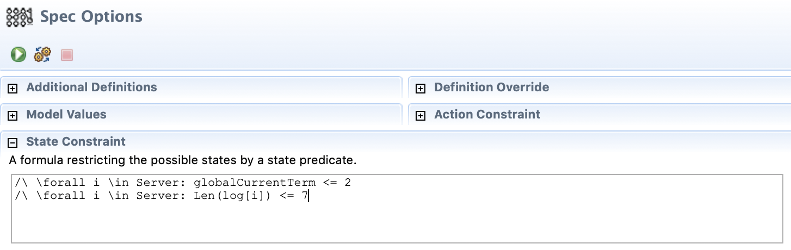
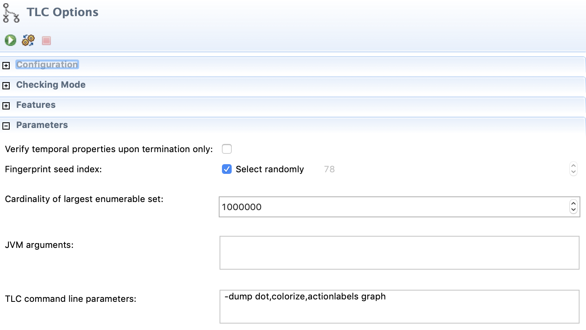

# MongoDB Replication Protocol Trace Checker

Compare a sequence of messages from an actual MongoDB replica set with
[Siyuan Zhou's TLA+ spec of MongoDB replication](https://github.com/visualzhou/mongo-repl-tla)
to check whether the actual replica set's steps are permitted by the spec.

## Background

TLA+ is a mathematical language for specifying distributed systems algorithms.
A TLA+ spec can be checked with TLC, a tool that verifies that any sequence of
steps the algorithm can perform will obey the spec's invariants. However,
checking that a TLA+ spec is correct does not guarantee that the spec matches
your actual program. One solution is model-based trace-checking[1]: check that
actual executions of your program, e.g. during integration tests, each match
some sequence of steps permitted by the spec.

[1]. Howard, Yvonne & Gruner, Stefan & Gravell, A & Ferreira, Carla & Augusto
Wrede, Juan. (2011). Model-Based Trace-Checking.

## This project

I want to check that an actual MongoDB replica set's series of state changes
correspond to a sequence of steps in Siyuan Zhou's TLA+ spec.

First I dump the entire state transition graph generated by the spec, in the
form of a GraphViz "dot file". TLC has several output formats; GraphViz is the
only one that includes the variable values at each state, and the actions that
transition from one state to the next.

Next I build mongod with extra tracing. Each time the server executes a step
that is equivalent to one of the TLA+ spec's actions (AppendOplog,
RollbackOplog, BecomePrimaryByMagic, or ClientWrite), it logs the actual values
of all variables that are modeled by the spec. I start a replica set, perform
some writes, and stop the set.

Finally, I run a Python script that reads the GraphViz state graph and all the
replica set members' logs. The script begins with the spec's initial state.
Then, for each log message from the replica set, the script creates a new state
that includes the changes expressed by the log message. For example, when a
member

## Instructions

**Dump all model states as a GraphViz file** 

* Install the TLA+ Toolbox.
* Clone [my "repl-trace-checker" branch of the TLA+ spec](https://github.com/ajdavis/mongo-repl-tla/tree/repl-trace-checker)
* Open RaftMongo.tla in the Toolbox
* "TLC Model Checker" -> "New Model"
* In "Model Overview" under "What Is The Model?", enter:



* "TLC Model Checker" -> "Run model"

**Run a replica set**

* Clone [my "repl-trace-checker" MongoDB branch](https://github.com/ajdavis/mongo/tree/repl-trace-checker)
* Build `mongod` and `mongo`
* Run the script included at the top directory on my branch:
```
./mongo --nodb sample-tla-plus-trace-replica-set.js
```

**Run the checker**

* Clone this repository
* With Python 3.6 or later:
```
python -m pip install -r requirements.txt
python repl-trace-checker.py <GRAPH> <LOG1> <LOG2> ...
```
* Replace GRAPH with the TLA+ Toolbox's dump, e.g.
  `mongo-repl-tla/RaftMongo.toolbox/Model_1/graph.dot`.
* Replace LOG1, LOG2, etc. with the `mongod.log` file of each replica.

(The first run will spend several minutes parsing `graph.dot`, and cache the
parsed graph.)

The script parses the mongod log files and correlates them with a trace through
the TLA+ state graph, logging each state and transition, until it reaches the
end of the logs or finds a discrepancy.

## Current status

The current TLA+ Spec needs some actions disabled in order to run, specifically
the "commit point learning protocol" actions. As a result, the commit point
never advances in the model, but an actual replica set's commit point *does*
advance. The trace checker fails, correctly, when it reaches the step in the
actual trace when the commit point advances.

[Sample output from the trace checker](sample-output.txt).

## Next Steps

* Uncomment the "commit point learning protocol" in the TLA+ spec and fix it
  up. Actual traces should pass the trace checker now.
* Trigger a rollback and check its trace.
* Introduce a bug in the actual replica set, traces should fail the checker.
* Prevent oplog truncation while the actual replica set is running.

## Implementation notes

Dumping the TLC output as a GraphViz dotfile is a hack: it would be much easier
to parse some other format, but GraphViz is the only format currently supported
by TLC that encodes both states and transitions. Unfortunately, parsing this
format is quite slow.

I tried parsing the file with pydot but it can't parse TLC's outputs (which
seems likely a pydot bug), so I use regexes.

The "label" property of each node in the GraphViz file is an escaped chunk of
TLA+, which I extract and parse with [a parser developed by Siyuan
Zhou](https://github.com/visualzhou/tla-trace-formatter).

Once the graph is parsed, the script serializes the Python data structure as
a "pickle", which is much faster to load. The graph changes very rarely, whereas
I expect the script to have different mongod log inputs on each run.
